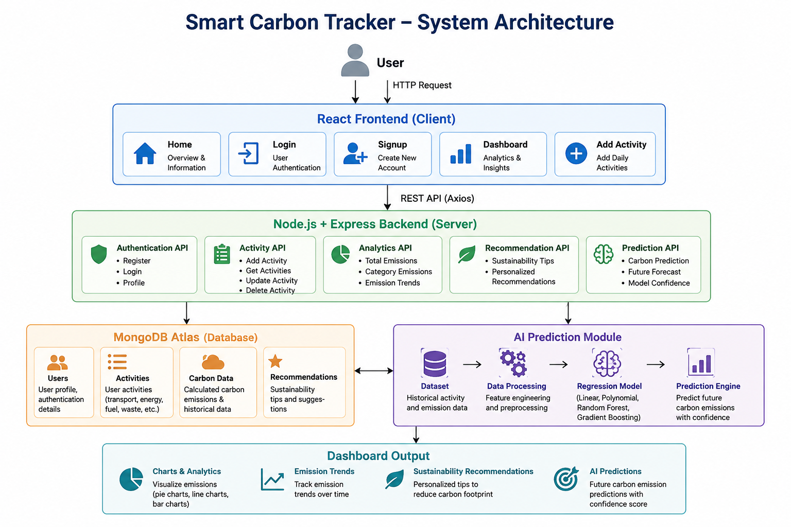

# 🌱 Smart Carbon Tracker

An AI-powered full-stack MERN web application that enables users to monitor, analyze, and reduce their carbon footprint through daily activity tracking, interactive analytics, and intelligent sustainability recommendations.

---

## ✨ Features

- 🔐 Secure User Authentication (Login & Signup)
- 🌍 Daily Carbon Emission Tracking
- 📊 Interactive Dashboard with Analytics
- 📈 Weekly Carbon Emission Visualization
- 🤖 AI-powered Sustainability Recommendations
- 📝 Activity Management (Add & View Activities)
- 💡 Carbon Reduction Insights
- 📱 Responsive and Modern User Interface

---

## 🛠️ Technology Stack

### Frontend
- React.js
- HTML5
- CSS3
- Axios

### Backend
- Node.js
- Express.js

### Database
- MongoDB Atlas

### AI / Machine Learning
- Python
- Scikit-learn
- Linear Regression (Prediction Module)

### Development Tools
- Git
- GitHub
- VS Code
- Postman

---

## 📂 Project Structure

```text
Smart-Carbon-Tracker/
│
├── client/
├── server/
├── ai/
├── docs/
├── screenshots/
├── README.md
├── package.json
└── .gitignore
```

---

## 📸 Project Screenshots

### 🏠 Home Page


---

### 🔑 Login Page


---

### 📝 Signup Page


---

### 📊 Dashboard


---

### ➕ Add Activity


---

### 🤖 AI Sustainability Recommendations


---

## 🏗️ System Architecture



---

## 🚀 Future Improvements

- Deep Learning based Carbon Prediction
- Personalized AI Recommendations
- Weather API Integration
- Real-time Environmental Data
- Goal Tracking & Progress Monitoring
- Monthly & Yearly Emission Reports
- Email Notifications
- Mobile Responsive Optimization
- Deployment on Cloud Platform

---

## 👨‍💻 Author

**Khushi Jatolia**

B.Tech Information Technology  
Rajiv Gandhi Institute of Petroleum Technology (RGIPT)

GitHub: https://github.com/KhushiJ08

---

## 📄 License

This project has been developed for academic, research, and educational purposes.

© 2026 Khushi Jatolia. All rights reserved.
