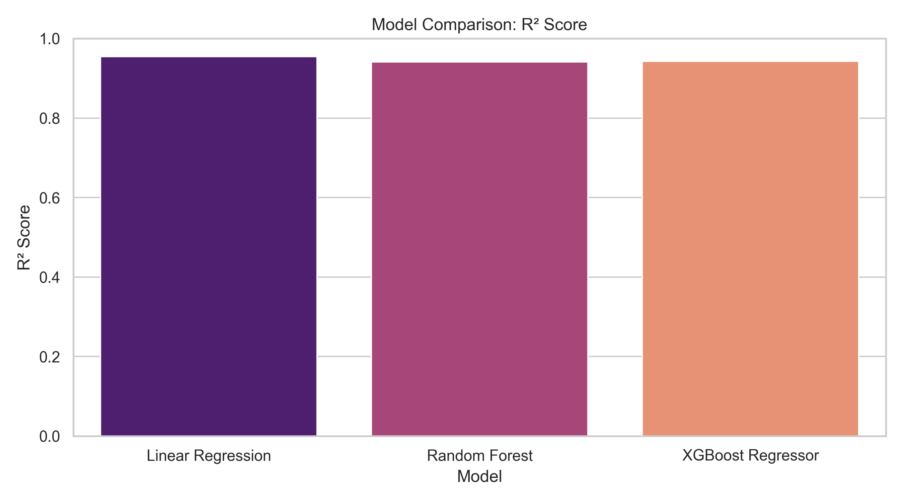
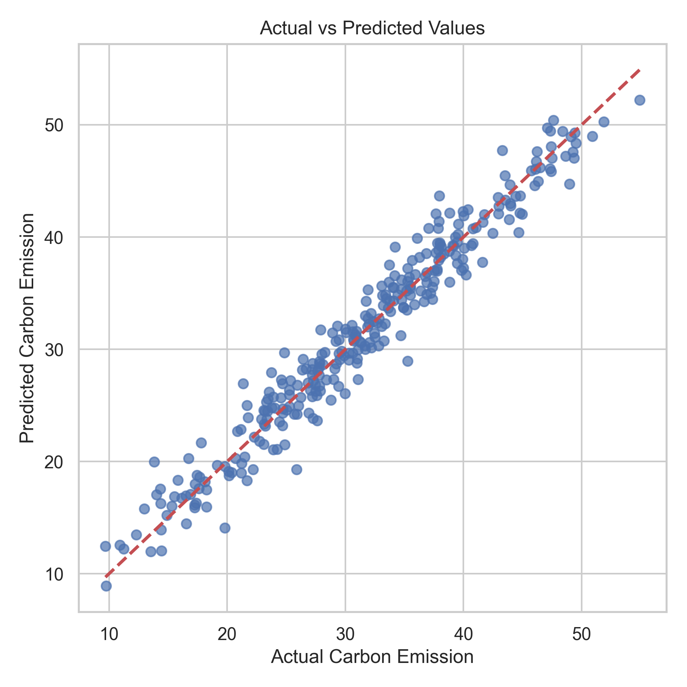
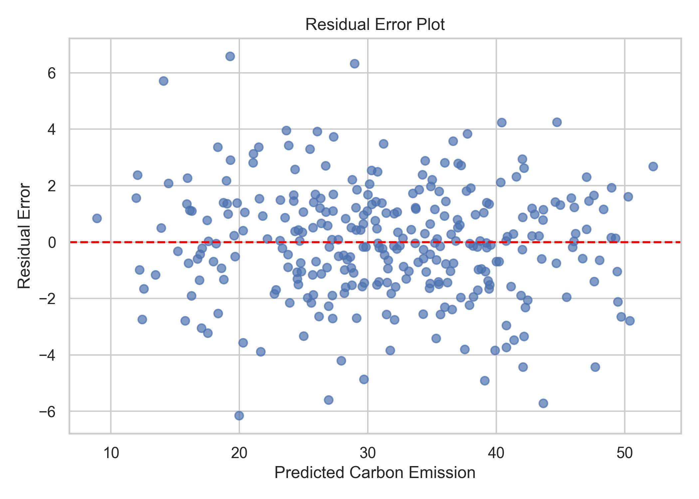

# AI/ML Module

The Smart Carbon Tracker incorporates a Machine Learning module to estimate future carbon emissions based on user activity data. The prediction model accepts three input features:

- Transportation Usage
- Electricity Consumption
- Fuel Consumption

The trained model processes these inputs and predicts the estimated carbon emission (kg CO₂). The prediction module is implemented in Python using Scikit-learn and is integrated with the Node.js backend, enabling real-time prediction within the web application.

Three regression algorithms—Linear Regression, Random Forest Regressor, and XGBoost Regressor—were trained and evaluated using the generated dataset. Based on the experimental evaluation, the **Linear Regression** model achieved the best predictive performance and was therefore selected as the deployment model due to its high accuracy, computational efficiency, and ease of integration with the web application.

---

# Dataset Description

A synthetic carbon emission dataset consisting of **1,500 samples** was generated to train and evaluate the machine learning models used in Smart Carbon Tracker. The dataset simulates daily carbon-emitting activities of individual users based on three major sources of emissions.

## Input Features

| Feature     | Range | Unit         |
| ----------- | ----: | ------------ |
| Transport   |  5–50 | km/day       |
| Electricity | 10–70 | kWh/month    |
| Fuel        |  2–40 | Liters/month |

## Target Variable

**Predicted Carbon Emission (kg CO₂)**

The target carbon emission was generated using the following relationship:

```text
Carbon Emission =
(0.35 × Transport)
+ (0.45 × Electricity)
+ (0.20 × Fuel)
+ Gaussian Noise
```

where Gaussian noise (mean = 0, standard deviation ≈ 2) was added to simulate realistic measurement variations.

## Assumptions

- Transportation contributes approximately **35%** of the total carbon emission.
- Electricity consumption contributes approximately **45%**.
- Fuel consumption contributes approximately **20%**.
- User activities are assumed to be independent.
- The generated data represents realistic household carbon-emission patterns.

## Why 1,500 Samples?

A dataset size of **1,500 samples** was selected to provide sufficient diversity for model training while maintaining low computational cost. The dataset is large enough to evaluate multiple regression algorithms reliably while ensuring efficient model training and testing.

## Data Splitting

The dataset was divided into **80% training data** and **20% testing data** using a fixed random seed (`random_state = 42`) to ensure reproducibility and unbiased evaluation of the regression models.

---

# Model Evaluation

Three regression algorithms were evaluated to determine the most suitable prediction model.

- Linear Regression
- Random Forest Regressor
- XGBoost Regressor

The following performance metrics were used:

- Mean Absolute Error (MAE)
- Root Mean Squared Error (RMSE)
- R² Score

## Experimental Results

| Model                   |       MAE |      RMSE |   R² Score |
| ----------------------- | --------: | --------: | ---------: |
| **Linear Regression**   | **1.551** | **1.997** | **0.9544** |
| Random Forest Regressor |     1.765 |     2.266 |     0.9413 |
| XGBoost Regressor       |     1.740 |     2.244 |     0.9424 |

The comparative evaluation demonstrates that all three regression models achieved high prediction accuracy. Among them, **Linear Regression** produced the lowest prediction error (MAE = 1.551 and RMSE = 1.997) while achieving the highest coefficient of determination (R² = 0.9544). Although Random Forest and XGBoost also produced competitive results, Linear Regression provided the best balance between prediction accuracy, computational efficiency, and deployment simplicity. Consequently, it was selected as the prediction model for Smart Carbon Tracker.

---

## Model Comparison



**Figure 2.** Comparison of the evaluated regression models using the R² Score. Linear Regression achieved the highest coefficient of determination among all evaluated models.

---

## Actual vs Predicted



**Figure 3.** Comparison of actual and predicted carbon emission values using the deployed Linear Regression model. The close alignment of the data points with the reference line indicates strong predictive performance.

---

## Residual Plot



**Figure 4.** Residual error distribution of the Linear Regression model. The residuals are randomly distributed around zero, indicating that the model captures the relationship between the input variables and carbon emissions effectively without significant systematic bias.

---

## Discussion

The experimental results demonstrate that all three regression models achieved strong predictive performance on the generated dataset. Linear Regression consistently outperformed the ensemble-based models by achieving the lowest prediction errors and the highest R² score. The Model Comparison chart highlights its superior overall performance, while the Actual vs Predicted plot confirms a strong agreement between observed and estimated values. Furthermore, the Residual Plot shows no noticeable systematic pattern, indicating that prediction errors are randomly distributed and the model generalizes well. Considering both predictive accuracy and computational efficiency, Linear Regression was selected as the final deployment model for the Smart Carbon Tracker application.
