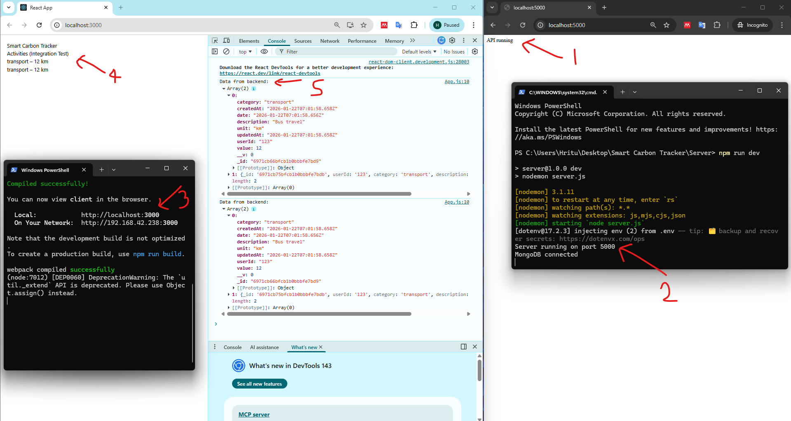
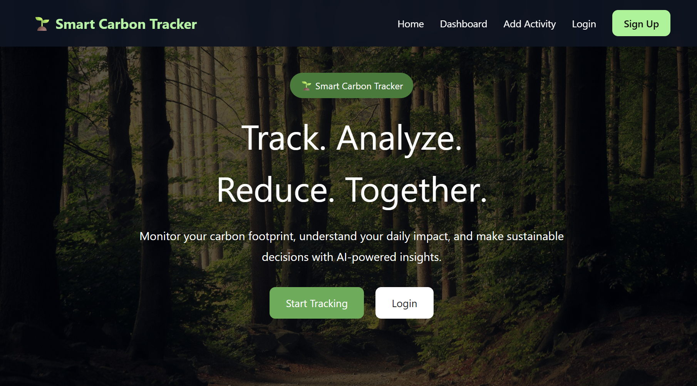
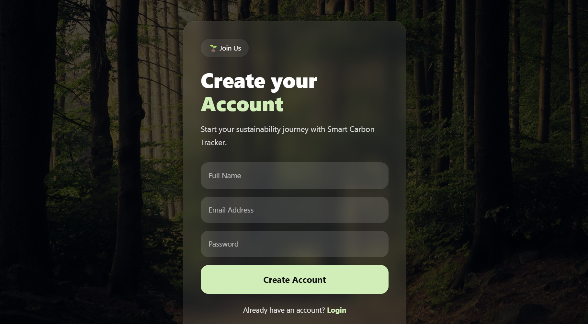
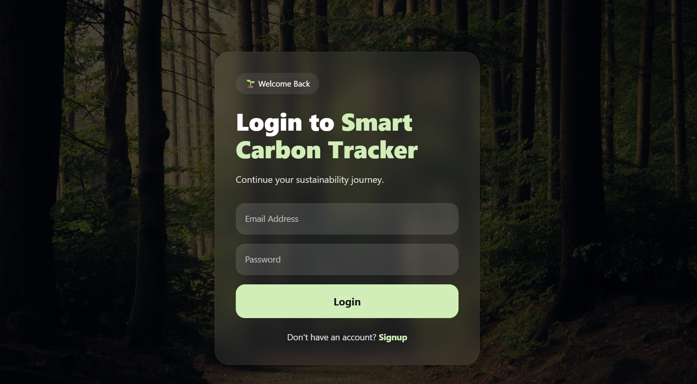
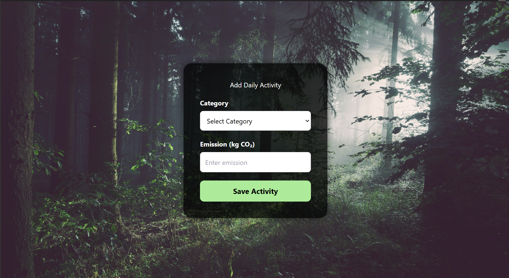
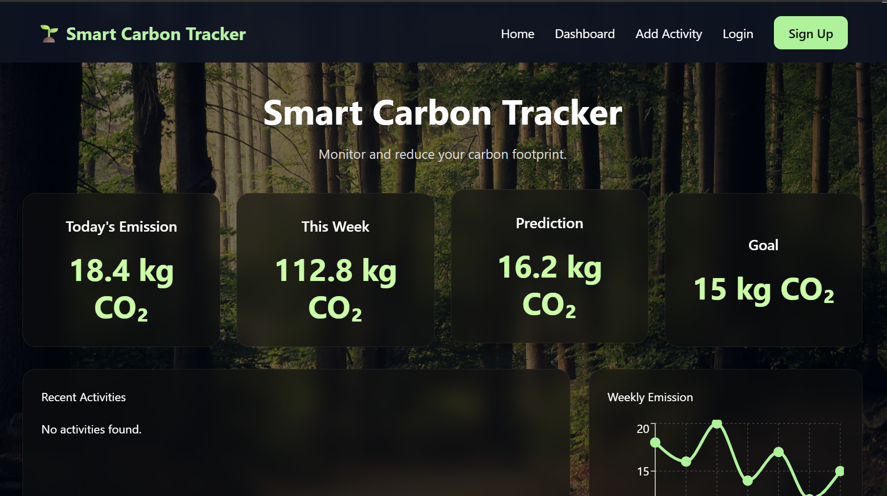
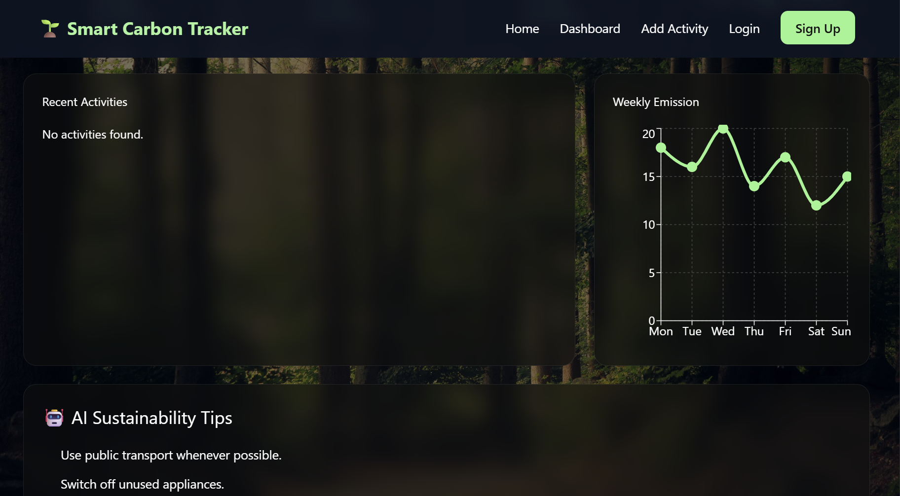

<p align="center">
  
</p>

<h1 align="center">Smart Carbon Tracker</h1>

<p align="center">
An AI-Driven Carbon Analytics Platform for Sustainability Monitoring and Emission Prediction
</p>

---

# Project Overview

Smart Carbon Tracker is an AI-powered web application designed to help individuals monitor, analyze, and reduce their carbon footprint through intelligent emission tracking and predictive analytics. The platform enables users to record daily carbon-emitting activities such as transportation, electricity consumption, and fuel usage while providing interactive dashboards to visualize emission trends over time.

The system integrates a full-stack MERN architecture with a machine learning module to predict future carbon emissions based on user activity data. By combining real-time activity management, data visualization, and AI-based prediction, the application encourages sustainable decision-making and promotes environmental awareness.

The project is being prepared as an open-source research software platform to support reproducible research, software reuse, and future extensions in AI-driven sustainability monitoring. Its modular architecture facilitates the integration of advanced recommendation systems, environmental APIs, and enhanced analytics in future versions.

---

# Problem Statement

Climate change has become one of the most significant global challenges, with increasing greenhouse gas emissions resulting from transportation, electricity consumption, and fossil fuel usage. Although several online carbon calculators are available, most provide only one-time estimates and lack facilities for continuous tracking, historical analysis, and future emission prediction.

There is a need for an integrated platform that not only calculates carbon emissions but also enables users to monitor their daily activities, visualize trends, predict future emissions using artificial intelligence, and receive recommendations for reducing their environmental impact.

Smart Carbon Tracker addresses this need by providing a unified platform that combines carbon footprint tracking, interactive analytics, machine learning-based prediction, and sustainability recommendations.

---

# Motivation

Growing environmental concerns and increasing awareness of climate change have highlighted the importance of monitoring individual carbon footprints. However, many existing solutions provide limited analytical capabilities and lack predictive intelligence.

The motivation behind Smart Carbon Tracker is to develop a user-friendly platform that combines modern web technologies with machine learning to make carbon footprint analysis more informative and actionable. By enabling users to understand both their current and future environmental impact, the system encourages sustainable lifestyle choices and demonstrates the practical application of artificial intelligence in environmental monitoring.

---

# Objectives

The primary objectives of Smart Carbon Tracker are:

- Design and develop an AI-powered web application for carbon footprint monitoring.
- Enable users to record and manage daily carbon-emitting activities efficiently.
- Store activity data securely using MongoDB.
- Provide interactive dashboards for visualizing historical emission trends.
- Predict future carbon emissions using machine learning regression models.
- Generate sustainability recommendations.
- Develop a modular and scalable software platform suitable for future research and deployment.

---

# Key Features

## Carbon Footprint Tracking

Users can record daily activities that contribute to carbon emissions, including transportation, electricity consumption, and fuel usage. Activity records are stored securely and can be viewed at any time.

## Dashboard Analytics

The dashboard provides interactive visualizations of carbon emissions, including total emissions, weekly trends, recent activities, and graphical summaries using Chart.js.

## AI-Based Carbon Emission Prediction

The application integrates a Python-based machine learning model to predict future carbon emissions. Multiple regression models were evaluated, and the prediction module is integrated with the web application for real-time forecasting.

## Sustainability Recommendations

The platform provides recommendations based on user activities and predicted emissions to encourage environmentally responsible behavior. The current implementation follows a rule-based approach with support for future AI-driven personalization.

## Secure Data Management

User information and activity records are stored securely in MongoDB using a structured backend developed with Node.js and Express.js.

## Modular Architecture

The application follows a modular MERN architecture that separates the frontend, backend, database, and AI components, improving maintainability and scalability.

---

# Technology Stack

| Layer           | Technologies                                             |
| --------------- | -------------------------------------------------------- |
| Frontend        | React.js, React Router DOM, Axios, HTML5, CSS3, Chart.js |
| Backend         | Node.js, Express.js                                      |
| Database        | MongoDB Atlas, Mongoose                                  |
| AI Module       | Python, Scikit-learn, XGBoost, NumPy, Pandas, Joblib     |
| Visualization   | Chart.js, Matplotlib, Seaborn                            |
| API Testing     | Postman                                                  |
| Version Control | Git, GitHub                                              |
| IDE             | Visual Studio Code                                       |

---

# System Architecture

Smart Carbon Tracker follows a modular full-stack architecture consisting of a React.js frontend, a Node.js and Express.js backend, a MongoDB Atlas database, and a Python-based machine learning module. The architecture enables users to record daily carbon-emitting activities, visualize emission trends, and obtain AI-based carbon emission predictions through an integrated web platform.

The frontend communicates with the backend using REST APIs. The backend manages user authentication, activity records, analytics, and prediction requests. User and activity data are stored in MongoDB Atlas, while the AI module processes user inputs using a trained Linear Regression model to estimate carbon emissions. The prediction results are returned to the backend and displayed on the user dashboard.

## System Architecture Diagram

<p align="center">
  
</p>

<p align="center"><b>Figure 1.</b> Overall System Architecture of Smart Carbon Tracker.</p>

---

## System Components

### Frontend

- Developed using **React.js**.
- Provides Login, Signup, Dashboard, and Add Activity pages.
- Sends and receives data using **Axios** and REST APIs.
- Displays emission analytics and prediction results using **Chart.js**.

### Backend

- Developed using **Node.js** and **Express.js**.
- Implements RESTful APIs for authentication, activity management, analytics, and prediction.
- Processes client requests and coordinates communication between the database and AI module.

### Database

- Uses **MongoDB Atlas** for persistent cloud storage.
- Stores user accounts, activity records, emission data, and recommendations.
- Managed using **Mongoose ODM**.

### AI Prediction Module

- Developed in **Python** using **Scikit-learn**.
- Implements and evaluates multiple regression algorithms.
- Uses the **Linear Regression** model for deployment based on its superior evaluation performance.
- Predicts carbon emissions from transportation, electricity, and fuel usage inputs.
- Returns prediction results to the backend for visualization on the dashboard.

---

## System Workflow

1. The user registers or logs into the application.
2. The user enters transportation, electricity, and fuel consumption data.
3. The frontend sends the data to the backend through REST APIs.
4. The backend stores user activity in MongoDB Atlas.
5. When prediction is requested, the backend invokes the Python AI module.
6. The Linear Regression model predicts the estimated carbon emission.
7. The prediction result is returned to the backend.
8. The dashboard displays emission analytics, prediction results, and sustainability recommendations to the user.

---

# Project Directory Structure

The project follows a modular architecture by separating the frontend, backend, AI module, documentation, datasets, and screenshots into independent directories. This structure improves code organization, maintainability, and future scalability.

```text
Smart Carbon Tracker/
│
├── client/                     # React.js Frontend
│   ├── public/
│   ├── src/
│   ├── package.json
│   └── ...
│
├── server/                     # Node.js + Express Backend
│   ├── config/
│   ├── controllers/
│   ├── middleware/
│   ├── models/
│   ├── routes/
│   ├── utils/
│   ├── server.js
│   └── package.json
│
├── ai/                         # Machine Learning Module
│   ├── models/
│   │   └── model.pkl
│   ├── carbon_emissions_dataset.csv
│   ├── train_and_evaluate.py
│   ├── predict.py
│   └── requirements.txt
│
├── docs/
│   └── system_architecture.png
│
├── screenshots/
│   ├── home.png
│   ├── login.png
│   ├── signup.png
│   ├── dashboard.png
│   ├── add_activity.png
│   └── ...
│
├── README.md
├── package.json
├── .gitignore
└── LICENSE
```

## Directory Description

| Directory      | Description                                                                           |
| -------------- | ------------------------------------------------------------------------------------- |
| `client/`      | Contains the React.js frontend application.                                           |
| `server/`      | Contains the Node.js and Express.js backend APIs.                                     |
| `ai/`          | Contains the machine learning models, dataset, prediction scripts, and training code. |
| `docs/`        | Stores project documentation and architecture diagrams.                               |
| `screenshots/` | Contains screenshots of the application's user interface.                             |
| `README.md`    | Main project documentation.                                                           |
| `.gitignore`   | Specifies files and folders excluded from version control.                            |
| `LICENSE`      | Defines the software license for the project.                                         |

---

# Installation Guide

## Prerequisites

Before running the project, install the following software:

- Node.js (v18 or later)
- Python 3.10 or later
- MongoDB Atlas account
- Git

---

## Clone Repository

```bash
git clone https://github.com/your-username/Smart-Carbon-Tracker.git

cd Smart-Carbon-Tracker
```

---

## Install Frontend Dependencies

```bash
cd client

npm install
```

---

## Install Backend Dependencies

```bash
cd ../server

npm install
```

---

## Install AI Dependencies

```bash
cd ../ai

pip install -r requirements.txt
```

---

## Configure Environment Variables

Create a `.env` file inside the `server` directory.

Example:

```env
MONGO_URI=your_mongodb_connection_string

JWT_SECRET=your_secret_key

PORT=5000
```

---

## Start Backend

```bash
cd server

npm run dev
```

---

## Start Frontend

```bash
cd client

npm start
```

---

# Usage Guide

1. Register a new account.
2. Login using registered credentials.
3. Add daily carbon-emitting activities.
4. View the dashboard for emission statistics.
5. Analyze weekly trends using interactive charts.
6. Predict future carbon emissions using the AI module.
7. Review sustainability recommendations.

---

# REST API Documentation

## Authentication

| Method | Endpoint              | Description         |
| ------ | --------------------- | ------------------- |
| POST   | `/api/users/register` | Register a new user |
| POST   | `/api/users/login`    | Authenticate user   |

---

## Activities

| Method | Endpoint                  | Description         |
| ------ | ------------------------- | ------------------- |
| POST   | `/api/activities/add`     | Add activity        |
| GET    | `/api/activities`         | Get all activities  |
| GET    | `/api/activities/:userId` | Get user activities |

---

## Analytics

| Method | Endpoint                  | Description             |
| ------ | ------------------------- | ----------------------- |
| GET    | `/api/analytics/weekly`   | Weekly analytics        |
| GET    | `/api/analytics/category` | Category-wise emissions |
| GET    | `/api/analytics/total`    | Total emissions         |

---

## AI Prediction

| Method | Endpoint              | Description                    |
| ------ | --------------------- | ------------------------------ |
| POST   | `/api/carbon/predict` | Predict future carbon emission |

---

## Recommendations

| Method | Endpoint               | Description                    |
| ------ | ---------------------- | ------------------------------ |
| GET    | `/api/recommendations` | Sustainability recommendations |

---

# AI/ML Module

The Smart Carbon Tracker incorporates a Machine Learning module to estimate future carbon emissions based on user activity data. The prediction model accepts three input features:

- Transportation Usage
- Electricity Consumption
- Fuel Consumption

The trained model processes these inputs and predicts the estimated carbon emission (kg CO₂). The prediction module is implemented in Python and integrated with the Node.js backend, enabling real-time prediction within the web application.

---

# Dataset Description

A synthetic carbon emission dataset containing **1,500 samples** was generated to evaluate the prediction models. Each sample consists of three input features representing major contributors to household carbon emissions:

- Transportation
- Electricity Consumption
- Fuel Usage

The target variable (Predicted Carbon Emission) was generated using weighted contributions from the input features with a small amount of Gaussian noise to simulate realistic variations in emission values.

## Dataset Summary

| Attribute      | Description                        |
| -------------- | ---------------------------------- |
| Dataset Size   | 1,500 records                      |
| Input Features | Transport, Electricity, Fuel       |
| Output         | Predicted Carbon Emission (kg CO₂) |
| Training Split | 80%                                |
| Testing Split  | 20%                                |

---

# Model Evaluation

Three regression algorithms were evaluated to determine the most suitable prediction model.

- Linear Regression
- Random Forest Regressor
- XGBoost Regressor

The following performance metrics were used:

- Mean Absolute Error (MAE)
- Root Mean Squared Error (RMSE)
- R² Score

## Experimental Results

| Model                   |       MAE |      RMSE |   R² Score |
| ----------------------- | --------: | --------: | ---------: |
| Linear Regression       | **1.551** | **1.997** | **0.9544** |
| Random Forest Regressor |     1.765 |     2.266 |     0.9413 |
| XGBoost Regressor       |     1.740 |     2.244 |     0.9424 |

The experimental evaluation demonstrates that all three regression models achieved high predictive performance. Among them, **Linear Regression** achieved the lowest prediction error and the highest R² Score (0.9544), making it the best-performing model for the current dataset.

---

# Screenshots

## Home Page

The landing page introduces the Smart Carbon Tracker platform and provides users with options to register, log in, and begin tracking their carbon footprint.



---

## User Registration

New users can create an account through the registration page.



---

## User Login

Registered users can securely access their personalized dashboard.



---

## Add Activity

Users can enter transportation, electricity, and fuel usage data for carbon footprint tracking.



---

## Dashboard

The dashboard provides visual analytics, prediction results, and sustainability recommendations.





---

# Future Enhancements

The following enhancements are planned for future versions of Smart Carbon Tracker:

- JWT-based authentication and authorization
- Personalized AI-driven recommendation engine
- Goal tracking and emission reduction monitoring
- PDF and CSV report generation
- Weather and Air Quality API integration
- Mobile-responsive enhancements
- Deployment on cloud platforms
- Advanced analytics and forecasting

---

# License

This project is licensed under the **MIT License**.

---

# Citation

If you use Smart Carbon Tracker in your research, please cite the software using the repository citation that will be provided after the public release and DOI generation through Zenodo.

---

# Authors

**Khushi Jatolia**

B.Tech, Information Technology

Rajiv Gandhi Institute of Petroleum Technology (RGIPT), Jais, India

Project Supervisor: **Dr. Gargi Srivastava**

---

# Acknowledgements

The author sincerely thanks **Dr. Gargi Srivastava** for her continuous guidance, valuable suggestions, and support throughout the development of the Smart Carbon Tracker project. Her mentorship and encouragement played a significant role in shaping the technical direction and research perspective of this work.

---

## Future Publication

This software is being prepared for public release as an open-source research software package with accompanying documentation and a software paper. Future versions will include enhanced AI capabilities, broader dataset support, and improved sustainability analytics.
